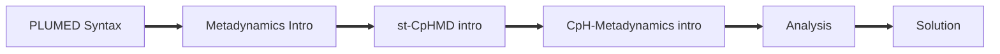

```mermaid
flowchart LR
A[PLUMED Syntax] ==> B[Metadynamics Intro]
B ==> C[st-CpHMD intro]
C ==> D[CpH-Metadynamics intro]
D ==> E[Analysis]
E ==> F[Solution]
click A "ref1" "You should be familiar with PLUMED syntax before completing this tutorial"
click B "ref2" "A brief introduction to metadynamics is useful before executing this tutorial"
click C "ref3" "Take a look into the source page and material for the CpH-Metadynamics"
click D "README.md" "A theoretical introduction to the CpH-Metadynamics method"
click E "analysis.md" "The instructions for the exercise"
click F "notebooks/solution.ipynb" "A python notebook containing a full set of solutions for the exercise"
```
