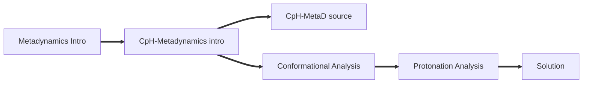

```mermaid
flowchart LR
A[Metadynamics Intro] ==> B[CpH-Metadynamics intro]
B ==> C[CpH-MetaD source]
B ==> D[Conformational Analysis]
D ==> E[Protonation Analysis]
E ==> F[Solution]

click A "ref1" "A brief introduction to metadynamics is useful before executing this tutorial"
click B "README.md" "A theoretical introduction to the CpH-Metadynamics method"
click C "ref2" "Take a look into the source page and material for the CpH-Metadynamics"
click D "Part1_Conformation.md" "Perform the conformation analysis of CpH-Metadynamics."
click E "Part2_Protonation.md" "Perform the protonation analysis of CpH-Metadynamics"
click F "notebooks/solution.ipynb" "A python notebook containing a full set of solutions for the exercise"
```
